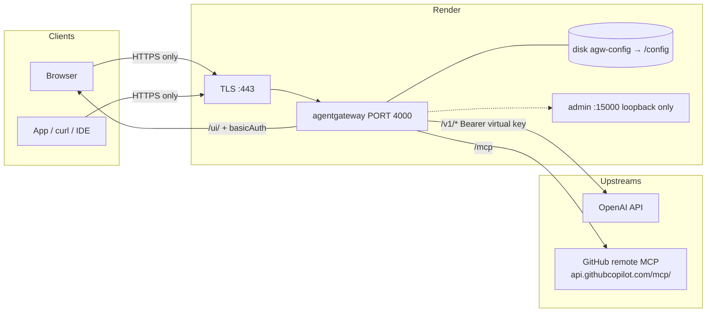

Most of what I've written about [agentgateway](https://agentgateway.dev) runs
on Kubernetes. That's the right home for it in production. 
<br>
But if you want something fast that runs in render.com and all you want is a **public HTTPS URL** you can hand to a
teammate, point an IDE at, and click around in — today, without a kind cluster, an ingress controller, and a cert-manager issuer.

<br>
This article is that shortcut. 

<br>
It's the hands-on build of the
[`34-render-deploy-agw`](https://github.com/sebbycorp/agentgateway-demos/tree/main/34-render-deploy-agw)
demo: standalone agentgateway **1.5.0** running as one [Render](https://render.com)
Web Service. 

<br>
<br>
When you're done, one hostname serves three things:

| Public path | Who uses it | How it's protected |
|-------------|-------------|--------------------|
| `/ui/` | You, the operator | Browser basic-auth prompt (`UI_USER` / `UI_PASSWORD`) |
| `/v1/*` | Apps, the playground, `curl` | A virtual API key sent as a Bearer token |
| `/mcp` | MCP clients | The gateway holds the GitHub token; clients never see it |

The screenshots are from the live service
[`agentgateway-standalone`](https://agentgateway-standalone.onrender.com), not
a mock. Every field name, env var, and log line comes from the committed
Blueprint and a real deploy.

## Before you start

You need four things:

- A **Render account** on at least the **Starter** plan. The Free plan has no
  persistent disks, and this lab needs one.
- An **OpenAI API key** (or any provider agentgateway supports — the steps
  are the same).
- A **GitHub personal access token** if you want the MCP part. Scope it
  tightly; more on that later.
- A password you're willing to type into a browser prompt. Render can
  generate one for you.

## What Render is, and why it fits

[Render](https://render.com) is a cloud platform-as-a-service in the Heroku
tradition. You connect a Git repository and tell Render how to build it (in
our case, a Dockerfile). Render builds the image, runs it, and puts it behind
a public hostname with a TLS certificate it provisions and renews for you.
Deploys, logs, environment variables, and persistent disks all live in one
dashboard.

Render also supports **Blueprints**: a `render.yaml` file in the repo that
declares the service, its plan, its env vars, and its disk. That's what makes
this deploy reproducible and one-click.

Three things make Render a good fit for an agentgateway lab:

- **TLS is handled.** Render terminates HTTPS on `:443` and forwards to your
  container. You never touch a certificate.
- **Disks persist.** agentgateway's config, its password file, and its SQLite
  database survive a redeploy on a 1 GB disk mounted at `/config`.
- **Env vars are the secret store.** Provider keys and the UI password live in
  the dashboard, and agentgateway expands `$VARS` in its config at runtime.
  Nothing sensitive goes into git.

The one constraint to know about: Render gives you **exactly one public
port**. That single fact shapes the whole design below.

## The shape of it



Because there's one public port, the UI, the LLM API, and the MCP endpoint
all share a single gateway on `:4000` and split by path. The admin interface
on `:15000` stays on loopback inside the container and is never on the
internet. Everything stateful lives on the `agw-config` disk at `/config`.

Two rules to keep in your head:

1. **HTTPS only.** Don't call the lab over `http://`, and don't try to reach
   `:4000` on the public hostname. Render's edge is the only door.
2. **The UI password and the LLM keys are separate.** The UI password
   protects `/ui/`. The LLM path is protected by virtual API keys. Sending
   the UI password as a Bearer token won't work, by design.

## Why the demo builds its own image

The demo does **not** deploy the official `cr.agentgateway.dev/agentgateway:v1.5.0`
image directly. It builds the repo's
[`deploy/Dockerfile`](https://github.com/sebbycorp/agentgateway-demos/blob/main/deploy/Dockerfile),
which wraps the official binary with a small Go entrypoint. Two reasons.

### Reason one: an empty config means an open UI

Start the official image with an empty `/config` and it auto-generates a
default config that serves `/ui/` with **no authentication**. On your laptop,
fine. On a public `.onrender.com` hostname, it's a live admin panel sitting
in front of your OpenAI key.

The entrypoint closes that hole on every boot:

- It reads `UI_USER` and `UI_PASSWORD` from the environment and writes a
  password line to `/config/.htpasswd`.
- If there's no `config.yaml`, it writes one with basic auth already turned
  on for the UI.
- If a `config.yaml` exists but the UI has no auth policy, it adds one.
- If `UI_PASSWORD` is missing, it refuses to start.

The seed config it writes is short:

```yaml
config:
  database:
    url: sqlite:///config/data.db
gateways:
  default:
    port: 4000
ui:
  gateways: [default]
  policies:
    basicAuth:
      mode: strict
      htpasswd:
        file: /config/.htpasswd
      realm: agentgateway
```

Then it hands off to `agentgateway -f /config/config.yaml`. From there the
gateway watches the file, so changes you make in the UI or by hand are
picked up live.

### Reason two: stdio MCP servers need Node

The official image is distroless: no shell, no Node. If you ever want to run
something like `npx -y @modelcontextprotocol/server-everything` as a stdio
MCP target, `npx` has to exist in the container. The Dockerfile's final stage
is Debian with Node 22, the gateway binary copied from the official image,
and the official image's CA bundle copied alongside it. The build fails if
any of those are missing, so a broken image never reaches Render.

One detail worth knowing: the image runs as root, because Render's disk is
root-owned and first boot has to write to `/config`. For a lab that's fine.

## The Blueprint

Everything Render needs is in
[`34-render-deploy-agw/render.yaml`](https://github.com/sebbycorp/agentgateway-demos/blob/main/34-render-deploy-agw/render.yaml):

```yaml
services:
  - type: web
    name: agentgateway
    runtime: docker
    plan: starter
    numInstances: 1
    autoDeployTrigger: off
    dockerfilePath: ./deploy/Dockerfile
    dockerContext: ./deploy
    disk:
      name: agw-config
      mountPath: /config
      sizeGB: 1
    envVars:
      - key: PORT
        value: "4000"
      - key: UI_PASSWORD
        sync: false
      - key: UI_USER
        value: admin
      - key: OPENAI_API_KEY
        sync: false
      - key: ANTHROPIC_API_KEY
        sync: false
      - key: GITHUB_PERSONAL_ACCESS_TOKEN
        sync: false
```

A few lines deserve a closer look:

- **`runtime: docker`**, not `runtime: image`. An "Existing Image" deploy
  skips the Dockerfile, skips the entrypoint, and leaves `/ui/` open.
- **`dockerfilePath` and `dockerContext` are relative to the repo root**, even
  though this Blueprint lives in a subdirectory. That's how Render's spec
  works, and it's why the paths say `./deploy/` and not `../deploy/`.
- **`PORT` is pinned to `4000`.** Render routes public traffic to `$PORT`,
  which defaults to `10000`. The gateway listens on `4000`. If they disagree
  you get a service that says "live" and never answers.
- **`autoDeployTrigger: off`** means pushes to the demos repo don't redeploy
  every copy that anyone has ever clicked the button for. Note it's *only*
  this field: Render rejects a Blueprint that sets both `autoDeploy` and
  `autoDeployTrigger`, so the older `autoDeploy: false` line is gone.
- **No `healthCheckPath`.** `/ui/` returns 401 by design, and Render would
  read that as unhealthy. Leaving the path out makes Render use a TCP check
  on `:4000` instead.

`sync: false` on a key means "ask me for this when the service is created,
and never store it in the repo."

## Step 1: create the service

**The easy way** is the Deploy button. Because the Blueprint isn't at the repo
root, the URL carries a `path` parameter (it's `path`, not `blueprintPath`):

```
https://render.com/deploy?repo=https://github.com/sebbycorp/agentgateway-demos&path=34-render-deploy-agw/render.yaml
```

**From the dashboard:** New → Blueprint, pick the repo, and set **Blueprint
Path** to `34-render-deploy-agw/render.yaml`.

**By hand:** New → Web Service, this repo, environment **Docker**, Dockerfile
path `./deploy/Dockerfile`, context `./deploy`, plan **Starter**. Whatever you
do, don't pick **Existing Image** with the official tag. That's the open-UI
trap from the previous section.


## Step 2: set the environment variables

Render prompts for every `sync: false` key when the Blueprint is first
created. You can also set them any time in the **Environment** tab.

| Variable | Required? | What it does |
|----------|-----------|--------------|
| `PORT` | **Yes** | Must be `4000` so Render's proxy and the gateway agree. |
| `UI_USER` | No | Basic-auth username. Defaults to `admin`. |
| `UI_PASSWORD` | **Yes** | Written to `/config/.htpasswd` on every start. Unset means the container exits. |
| `OPENAI_API_KEY` | For OpenAI | Referenced as `$OPENAI_API_KEY` on the model. |
| `GITHUB_PERSONAL_ACCESS_TOKEN` | For GitHub MCP | Sent upstream by the gateway to `api.githubcopilot.com`. |

Use Render's **Generate** button for `UI_PASSWORD`. Paste provider tokens
straight into the dashboard, never into git.


## Step 3: check the disk

The Blueprint already declares a 1 GB disk named `agw-config` mounted at
`/config`. That's where `config.yaml`, `.htpasswd`, and the SQLite database
live. Without it, every deploy starts from scratch: your models, virtual
keys, MCP servers, and logs all disappear.

Nothing to do here except confirm it's there. If you built the service by
hand, add it under **Disks**.


## Step 4: deploy and watch the logs

Start the deploy. On first boot the entrypoint writes the password file and
the seed config, then the gateway starts. In the Render log stream, these are
the lines that mean it worked:

```
state_manager Watching config file: /config/config.yaml
app serving UI at http://localhost:4000/ui
proxy::gateway started bind bind="bind/4000"
... admin on 127.0.0.1:15000
==> Your service is live
```

Soon after, you'll likely see a `401` on `/ui/` with
`basic authentication failure: no basic authentication credentials found`.
**That's good news.** It means the UI is up and asking for a password.


## Step 5: open the UI

```
https://<your-service>.onrender.com/ui/
```

Your browser asks for a username and password. Enter `UI_USER` and
`UI_PASSWORD`. The Gateway Overview should show LLM, MCP, and Traffic panels,
all attached to the gateway named **default**.


## Step 6: add OpenAI

Go to **LLM → Models → Add model** and fill in:

- Incoming model name: `*`
- Provider: **OpenAI**
- API key: `$OPENAI_API_KEY`
- Outgoing model: leave as "Incoming model"

The `*` means "any model name a client asks for," and "Incoming model" means
"pass that name through to OpenAI unchanged." The `$OPENAI_API_KEY` reference
is expanded at runtime, so the real key never lands in `config.yaml`.

If you'd rather edit the file on the disk, this is the same thing:

```yaml
llm:
  gateways: [default]
  models:
  - name: '*'
    provider: openAI
    params:
      apiKey: $OPENAI_API_KEY
```


## Step 7: add virtual API keys

This is what makes a public `/v1/*` safe to expose. Go to **LLM → Virtual API
Keys** (or edit `config.yaml`) and set the policy to **strict** mode, which
means every request must carry a key the gateway knows.

The lab defines three keys with three different scopes:

| Key (placeholder) | Name | Models allowed | Extra |
|-------------------|------|----------------|-------|
| `sk-lab-admin-...` | `admin` | any | — |
| `sk-lab-demo-...` | `demo` | a chosen list | — |
| `sk-lab-limited-...` | `limited` | `gpt-4.1-nano` only | 1,000 tokens per rolling hour, then blocked |

```yaml
llm:
  policies:
    apiKey:
      mode: strict
      keys:
      - key: sk-lab-admin-...
        metadata: { name: admin }
      - key: sk-lab-demo-...
        metadata: { name: demo }
        allowedModels: [gpt-4.1-nano, gpt-4.1, gpt-4o]
      - key: sk-lab-limited-...
        metadata: { name: limited }
        allowedModels: [gpt-4.1-nano]
        budgets:
        - name: tokens
          limit: { unit: Tokens, amount: 1000 }
          window: { rolling: 1h }
          onBudgetExceeded: Block
```

Once strict mode is on, a `GET /v1/models` with no `Authorization` header
returns `api key authentication failure: no API Key found`. That's the policy
working, not a bug.

The `sk-lab-...` strings are placeholders. Your real keys live only on the
disk and in the dashboard. For the full story on `allowedModels`, budgets,
and windows, see
[the per-key token budgets how-to](/articles/2026-08-27-agentgateway-api-key-token-budgets-howto/).

## Step 8: make a chat call

In the UI's **Chat Playground**, pick a specific model first. The wildcard
row won't let you hit Send until you do; `gpt-4.1-nano` is what the live
logs show.

From a terminal, it's a normal OpenAI-style call with a virtual key as the
Bearer token:

```sh
export HOST=https://agentgateway-standalone.onrender.com
export VKEY='sk-lab-limited-...'   # placeholder — use your own key

curl -sS "$HOST/v1/chat/completions" \
  -H "Authorization: Bearer $VKEY" \
  -H 'Content-Type: application/json' \
  -d '{
    "model": "gpt-4.1-nano",
    "messages": [{"role": "user", "content": "Reply with one word: pong"}]
  }'
```

A successful call shows up under **LLM → Logs** with the model OpenAI
actually resolved, the latency, and the token counts.


## Step 9: add the GitHub MCP server

Go to **MCP → Servers → Add server** and fill in:

- Name: `github`
- Type: **Streamable HTTP**
- Endpoint: `https://api.githubcopilot.com/mcp/`

Attach it to the existing `default` gateway. There's no second public port
to put it on, and you don't need one.

The authentication is a **backend** key: the gateway holds your GitHub token
and adds it to every upstream call. MCP clients never see it.

```yaml
mcp:
  gateways: [default]
  targets:
  - name: github
    mcp:
      host: https://api.githubcopilot.com/mcp/
    policies:
      backendAuth:
        key:
          value: $GITHUB_PERSONAL_ACCESS_TOKEN
```

The server's state should turn **ready**. Clients then connect to
`https://<your-service>.onrender.com/mcp`, and the playground's "Include MCP
tools" toggle will show one server.


Want a stdio server too? The image already has `npx`, so a
`server-everything` target works. Attach it to `default` like everything
else. One port.

## Step 10: prove it works

This is the whole smoke test. HTTPS only, placeholders for secrets.

```sh
HOST=https://<your-service>.onrender.com

# 1. UI is locked without credentials
curl -sI "$HOST/ui/" | grep -E 'HTTP/|www-authenticate'
# HTTP/2 401
# www-authenticate: Basic realm="agentgateway"

# 2. UI opens with credentials
curl -sI -u "$UI_USER:$UI_PASSWORD" "$HOST/ui/" | head -5
# HTTP/2 200

# 3. LLM path refuses anonymous callers
curl -sS "$HOST/v1/models"
# api key authentication failure: no API Key found

# 4. LLM path works with a virtual key
curl -sS "$HOST/v1/models" -H "Authorization: Bearer sk-lab-admin-..."
curl -sS "$HOST/v1/chat/completions" \
  -H "Authorization: Bearer sk-lab-limited-..." \
  -H 'Content-Type: application/json' \
  -d '{"model":"gpt-4.1-nano","messages":[{"role":"user","content":"Reply with one word: pong"}]}'
# the limited key has a token budget — expect 429 budget_exceeded once it fills

# 5. MCP handshake reaches GitHub
curl -sS "$HOST/mcp" \
  -H 'Content-Type: application/json' \
  -H 'Accept: application/json, text/event-stream' \
  -H 'mcp-protocol-version: 2025-06-18' \
  -d '{"jsonrpc":"2.0","id":1,"method":"initialize","params":{"protocolVersion":"2025-06-18","capabilities":{},"clientInfo":{"name":"howto","version":"1"}}}'
# look for serverInfo.name: github-mcp-server
```

If you see a 401 on the UI without credentials, a 200 with them, a 401 on
`/v1/models` without a key, and an MCP response naming `github-mcp-server`,
you're done.

## What's reachable, in one table

Render publishes HTTPS `:443` to one container port, and that port is `4000`.
Nothing else is reachable, and nothing else should be.

| Address | Reachable from the internet? |
|---------|------------------------------|
| `https://<service>.onrender.com/ui/` | Yes, with basic auth |
| `https://<service>.onrender.com/v1/*` | Yes, with a virtual API key |
| `https://<service>.onrender.com/mcp` | Yes, for MCP clients |
| `http://<service>.onrender.com/...` | Don't use it |
| `:4000` on the public hostname | Don't use it |
| `:15000` | No. Loopback only. |

## Six mistakes that will cost you an afternoon

1. **Forgetting to pin `PORT`.** Render defaults `$PORT` to `10000`; the
   gateway listens on `4000`. The deploy says "live" and every request times
   out. Set `PORT=4000`.
2. **Choosing "Existing Image" instead of the Dockerfile.** You skip the
   entrypoint, the empty `/config` auto-generates an open config, and `/ui/`
   is on the internet with no password.
3. **Setting a health check on `/ui/`.** It returns 401 without credentials.
   Render reads that as unhealthy and restarts a perfectly good service
   forever. Leave `healthCheckPath` out.
4. **Using the Free plan.** No disks on Free. Every deploy wipes your config,
   keys, and logs. Starter is the minimum.
5. **Putting a bcrypt hash inline in `config.yaml`.** bcrypt hashes contain
   `$`, and agentgateway expands `$VARS` in the config. The hash gets
   mangled and nobody can log in. That's exactly why the entrypoint writes a
   separate password file instead.
6. **Sending the UI password to `/v1/*`.** The UI policy and the LLM policy
   are separate. The UI password is for the browser prompt. The LLM path
   wants a virtual key.

## What this is, and isn't, security-wise

What you get is basic auth in strict mode, backed by a password file the
entrypoint rewrites on every start, behind Render's TLS. An unauthenticated
`GET /ui/` returns **401** with `WWW-Authenticate: Basic realm="agentgateway"`.

That is **demo-grade**. It's not an identity provider, and basic auth is not
single sign-on. Before this URL becomes anything more than a short-lived lab:

- **Rotate everything** that has ever appeared in a screenshot or a chat:
  `UI_PASSWORD`, `OPENAI_API_KEY`, `GITHUB_PERSONAL_ACCESS_TOKEN`, and every
  virtual key.
- **Scope the GitHub token tightly.** The remote MCP server will do whatever
  that token can do, on behalf of anyone who can reach `/mcp`.
- **Move the UI to OIDC.** It needs an identity provider and an
  `OIDC_COOKIE_SECRET` (32 random bytes as 64 hex characters). The upstream
  guide is
  [Secure the UI (OIDC)](https://agentgateway.dev/docs/standalone/latest/documentation/setup/ui/secure-ui/).

## The takeaway

The interesting part of this build isn't Render, and it isn't agentgateway.
It's how little sits between them. One `render.yaml`, one Dockerfile that adds
an entrypoint and Node to the official binary, five environment variables,
and a 1 GB disk. That's enough for a public, TLS-terminated gateway that puts
an LLM provider behind per-key policy and a remote MCP server behind a
credential the clients never hold.

The one-port constraint that looks like a limitation is actually the design:
one hostname, one gateway, three paths, three auth models, each doing one
job. When you outgrow it, the same `config.yaml` moves to a bigger box or a
cluster unchanged. Until then, this is the fastest way I know to put
agentgateway somewhere a colleague can actually reach.

---

*The Blueprint, the example config, the `.env.example`, and all ten
screenshots are in
[sebbycorp/agentgateway-demos / 34-render-deploy-agw](https://github.com/sebbycorp/agentgateway-demos/tree/main/34-render-deploy-agw).
The container it builds is
[`deploy/Dockerfile`](https://github.com/sebbycorp/agentgateway-demos/blob/main/deploy/Dockerfile),
pinned to [agentgateway v1.5.0](https://github.com/agentgateway/agentgateway/releases/tag/v1.5.0);
the standalone config schema is at <https://agentgateway.dev/schema/config>.
For what to do with the virtual keys once they exist, see
[Per-Key Token Budgets in agentgateway 1.5.0](/articles/2026-08-27-agentgateway-api-key-token-budgets-howto/).*
