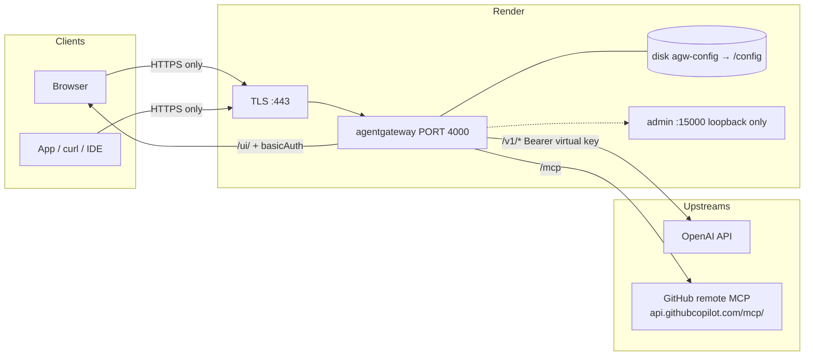

Most of what I've written about [agentgateway](https://agentgateway.dev) runs
on a Kubernetes cluster. That's the right home for it in production. It is the
wrong first step when all you want is a **public HTTPS URL** you can hand to a
teammate, point an IDE at, and click around in — today, before lunch, without a
kind cluster, an ingress controller, and a cert-manager issuer.

This article is that shortcut. It's the hands-on build of the
[`34-render-deploy-agw`](https://github.com/sebbycorp/agentgateway-demos/tree/main/34-render-deploy-agw)
demo: standalone agentgateway **1.5.0** deployed as a single [Render](https://render.com)
Web Service. When you're done you have one `https://<service>.onrender.com`
hostname serving three things on one port:

| Public path | Who it is for | Auth |
|-------------|----------------|------|
| `/ui/` | Operators | HTTP basic (`UI_USER` / `UI_PASSWORD`) |
| `/v1/*` | Apps, playground, `curl` | Strict virtual API key — Bearer token |
| `/mcp` | MCP clients | GitHub PAT held by the gateway, not the client |

The screenshots below are from the live service
[`agentgateway-standalone`](https://agentgateway-standalone.onrender.com), not
a mock. Every field name, env var, and log line comes from the committed
Blueprint and a real deploy.

## What Render is, and why it fits here

[Render](https://render.com) is a cloud platform-as-a-service in the Heroku
lineage. You connect a Git repository, tell Render how to build it (a
Dockerfile in our case), and it builds the image, runs it, and puts it behind a
public hostname with a TLS certificate that it provisions and renews for you.
Zero-downtime deploys, log streaming, environment-variable management, and
persistent disks are all in the dashboard. It also supports **Blueprints** — a
`render.yaml` file in the repo that declares the service, its plan, its env
vars, and its disk, so the whole thing is reproducible and one-click.

Three properties make it a good match for a standalone agentgateway lab:

- **One container, one public port, TLS handled.** Render terminates HTTPS on
  `:443` and forwards to whatever port your container exposes via `$PORT`. You
  never touch a certificate.
- **Persistent disks on paid plans.** agentgateway's config, the htpasswd
  file, and its SQLite database need to survive a redeploy. A 1 GB disk
  mounted at `/config` does that.
- **Env vars as the secret store.** Provider keys and the UI password live in
  the dashboard, get injected at runtime, and agentgateway expands `$VARS` in
  its config. Nothing sensitive goes into git.

The trade-off is the flip side of the first point: Render gives you
**exactly one** public port. That single constraint shapes the entire design
below.

## What you'll build



Because Render publishes one port, the UI, the LLM API, and the MCP endpoint
all share a single gateway — `gateways.default` on `:4000` — and split by
path. The admin interface on `:15000` stays on loopback inside the container
and is never on the internet. Config, htpasswd, and SQLite live on the
`agw-config` disk mounted at `/config`.

Two rules fall out of this and are worth stating up front:

- **HTTPS only.** Don't call the lab over `http://`, and don't try to reach
  `:4000` on the public hostname. Render's edge is the only door.
- **`ui.policies` does not cover `/v1/*`.** The UI password protects the UI.
  The LLM path is protected separately by strict virtual API keys. Don't send
  the UI password as a Bearer token and expect it to work.

## The image: why not just run the official container?

The demo does **not** deploy `cr.agentgateway.dev/agentgateway:v1.5.0`
directly. It builds the repo's
[`deploy/Dockerfile`](https://github.com/sebbycorp/agentgateway-demos/blob/main/deploy/Dockerfile),
which wraps the official binary with a small static Go entrypoint. There are
two reasons, and both matter.

**Reason one: an empty `/config` gives you an unauthenticated UI.** The
official image, started with an empty config directory, auto-generates a
default config and serves `/ui/` with **no auth at all**. On a private
laptop that's fine. On a public `.onrender.com` hostname it's a live admin
panel for your OpenAI key. The entrypoint fixes this on every boot: it reads
`UI_USER` and `UI_PASSWORD` from the environment, writes an htpasswd line to
`/config/.htpasswd`, and if no `config.yaml` exists it seeds one with
`ui.policies.basicAuth` in `mode: strict`. If a config *does* exist but has no
auth policy on the UI, it injects one. If `UI_PASSWORD` is unset, the process
exits 1 rather than start unprotected.

The seed it writes is exactly this:

```yaml
config:
  database:
    url: sqlite:///config/data.db
gateways:
  default:
    port: 4000
ui:
  gateways: [default]
  policies:
    basicAuth:
      mode: strict
      htpasswd:
        file: /config/.htpasswd
      realm: agentgateway
```

Then it `exec`s `/app/agentgateway -f /config/config.yaml` and gets out of the
way. From there the gateway watches the file, so edits from the UI or by hand
are picked up live.

**Reason two: stdio MCP servers need Node.** The official image is
distroless — no shell, no Node. If you ever want to attach
`npx -y @modelcontextprotocol/server-everything` as a stdio target, you need
`npx` in the container. The Dockerfile's final stage is Debian trixie-slim
with Node 22 copied in, the gateway binary copied from the official image, and
the official image's CA bundle copied alongside (the gateway is a rustls binary
that loads the *system* CA store, and trixie-slim ships none). The build fails
if `node`, `npx`, the gateway binary, or the CA file is missing, so a broken
image never reaches Render.

One more detail: the image runs as root. The published image's user is 65532,
but PaaS volumes are typically root-owned, and first boot has to write
`/config`. For a lab that's an acceptable trade.

## The Blueprint

Everything Render needs is in
[`34-render-deploy-agw/render.yaml`](https://github.com/sebbycorp/agentgateway-demos/blob/main/34-render-deploy-agw/render.yaml):

```yaml
services:
  - type: web
    name: agentgateway
    runtime: docker
    plan: starter
    numInstances: 1
    autoDeploy: false
    autoDeployTrigger: off
    dockerfilePath: ./deploy/Dockerfile
    dockerContext: ./deploy
    disk:
      name: agw-config
      mountPath: /config
      sizeGB: 1
    envVars:
      - key: PORT
        value: "4000"
      - key: UI_PASSWORD
        sync: false
      - key: UI_USER
        value: admin
      - key: OPENAI_API_KEY
        sync: false
      - key: ANTHROPIC_API_KEY
        sync: false
      - key: GITHUB_PERSONAL_ACCESS_TOKEN
        sync: false
```

Four lines in there carry most of the weight:

- **`runtime: docker`**, not `runtime: image`. An Existing Image deploy skips
  the Dockerfile, skips the entrypoint, and leaves `/ui/` open.
- **`dockerfilePath` / `dockerContext` are relative to the repo root**, even
  though this Blueprint lives in a subdirectory. That's the Render spec, and
  it's why the paths say `./deploy/...` and not `../deploy/...`.
- **`PORT` is pinned to `4000`.** Render routes public traffic to `$PORT`,
  which defaults to `10000`. The seeded gateway listens on 4000. If they
  disagree you get a service that is "live" and unreachable.
- **No `healthCheckPath`.** More on that in the gotchas, but the short version
  is that `/ui/` returns 401 by design, and Render would read that as
  unhealthy. Omitting the path makes Render use a TCP check on `:4000`.

`sync: false` on a key means "prompt me for this at create time and never
store it in the repo." `autoDeploy` is off so pushes to the demos repo don't
redeploy every copy anyone has ever clicked the button for.

## Step 1 — create the Render web service

The fast path is the button. Render's one-click URL takes a `path` query
parameter (not `blueprintPath`) because the Blueprint is not at the repo root:

```
https://render.com/deploy?repo=https://github.com/sebbycorp/agentgateway-demos&path=34-render-deploy-agw/render.yaml
```

Or from the dashboard: **New → Blueprint**, pick the repo, and set
**Blueprint Path** to `34-render-deploy-agw/render.yaml`.

If you'd rather do it by hand: **New → Web Service**, this repo, environment
**Docker**, Dockerfile path `./deploy/Dockerfile`, context `./deploy`, plan
**Starter**. Do **not** choose **Existing Image** with
`cr.agentgateway.dev/agentgateway:v1.5.0` — that's the no-auth trap from the
previous section.


## Step 2 — set the environment variables

Render prompts for every `sync: false` key on first Blueprint create. Set them
in the **Environment** tab, never in git:

| Variable | Required | Purpose |
|----------|----------|---------|
| `PORT` | **Yes** | Must be `4000`. Render proxies `$PORT`; the gateway listens on 4000. |
| `UI_USER` | No | Basic-auth username. Defaults to `admin`. |
| `UI_PASSWORD` | **Yes** | The entrypoint writes `/config/.htpasswd` from it on every start. Unset means exit 1. |
| `OPENAI_API_KEY` | For OpenAI | Expanded as `$OPENAI_API_KEY` on the model. |
| `GITHUB_PERSONAL_ACCESS_TOKEN` | For GitHub MCP | The Bearer the gateway sends upstream to `api.githubcopilot.com`. |

Use Render's **Generate** button for `UI_PASSWORD`. Paste the provider tokens
straight into the dashboard.


## Step 3 — the disk

The Blueprint already declares a 1 GB disk named `agw-config` mounted at
`/config`. That's where `config.yaml`, `.htpasswd`, and the SQLite database
(`data.db`) live. Without it, every deploy starts from an empty directory:
your models, virtual keys, MCP servers, and LLM logs all vanish.

One plan note: **disks are not available on Render's Free tier**. Starter is
the floor for this lab, and the disk is the whole persistence story.


## Step 4 — deploy and read the logs

Kick off the deploy. First boot writes `.htpasswd` and the seed `config.yaml`,
then the gateway starts watching the file. In the Render log stream these are
the lines that mean it worked:

```
state_manager Watching config file: /config/config.yaml
app serving UI at http://localhost:4000/ui
proxy::gateway started bind bind="bind/4000"
... admin on 127.0.0.1:15000
==> Your service is live
```

Shortly after, you'll probably see an `http.status=401` on `/ui/` with
`basic authentication failure: no basic authentication credentials found`.
**That is success.** It means the UI is up and the auth policy is enforcing.


## Step 5 — open the UI over HTTPS

```
https://<your-service>.onrender.com/ui/
```

Your browser will prompt for basic auth: `UI_USER` / `UI_PASSWORD`. The
Gateway Overview should show LLM, MCP, and Traffic panels, all attached to
gateway **default**.


## Step 6 — add OpenAI

**LLM → Models → Add model.** Incoming model name `*`, provider **OpenAI**,
API key `$OPENAI_API_KEY`. Leave the outgoing model as "Incoming model" so
whatever the client asks for is what OpenAI receives. The gateway
env-expands the `$OPENAI_API_KEY` reference at runtime, so the real key never
lands in `config.yaml`.

The equivalent YAML, if you'd rather edit the file on the disk:

```yaml
llm:
  gateways: [default]
  models:
  - name: '*'
    provider: openAI
    params:
      apiKey: $OPENAI_API_KEY
```


## Step 7 — add virtual API keys

This is the piece that makes a public `/v1/*` safe to expose. **LLM → Virtual
API Keys** (or edit `/config/config.yaml`) and set `apiKey` to `mode: strict`.
The lab uses three keys with three different envelopes:

| Key (placeholder) | `metadata.name` | Models | Extra |
|-------------------|-----------------|--------|--------|
| `sk-lab-admin-...` | `admin` | any | — |
| `sk-lab-demo-...` | `demo` | selected models | — |
| `sk-lab-limited-...` | `limited` | `gpt-4.1-nano` only | rolling 1,000-token budget per hour |

```yaml
llm:
  policies:
    apiKey:
      mode: strict
      keys:
      - key: sk-lab-admin-...
        metadata: { name: admin }
      - key: sk-lab-demo-...
        metadata: { name: demo }
        allowedModels: [gpt-4.1-nano, gpt-4.1, gpt-4o]
      - key: sk-lab-limited-...
        metadata: { name: limited }
        allowedModels: [gpt-4.1-nano]
        budgets:
        - name: tokens
          limit: { unit: Tokens, amount: 1000 }
          window: { rolling: 1h }
          onBudgetExceeded: Block
```

Strict mode means a `GET /v1/models` with no `Authorization` header returns
`api key authentication failure: no API Key found`. That's the policy working,
not a bug. The strings above are placeholders; the real ones live only on the
disk and in the dashboard. If you want the deep dive on `allowedModels`,
budgets, and windows, that's
[the per-key token budgets how-to](/articles/2026-08-27-agentgateway-api-key-token-budgets-howto/).

## Step 8 — call chat completions

In the UI's **Chat Playground**, the wildcard model row needs a **specific**
model selected before Send lights up — `gpt-4.1-nano` is what the live logs
show. From a client it's a normal OpenAI-compatible call, over HTTPS, with a
virtual key as the Bearer:

```sh
export HOST=https://agentgateway-standalone.onrender.com
export VKEY='sk-lab-limited-...'   # placeholder — use your lab key

curl -sS "$HOST/v1/chat/completions" \
  -H "Authorization: Bearer $VKEY" \
  -H 'Content-Type: application/json' \
  -d '{
    "model": "gpt-4.1-nano",
    "messages": [{"role": "user", "content": "Reply with one word: pong"}]
  }'
```

A 200 with token usage shows up under **LLM → Logs**, with the model OpenAI
actually resolved (`gpt-4.1-nano-2025-04-14`), latency, and input/output
tokens.


## Step 9 — add the GitHub remote MCP server

**MCP → Servers → Add server.**

- Name: `github`
- Type: **Streamable HTTP**
- Endpoint: `https://api.githubcopilot.com/mcp/`

Attach it to the existing `default` gateway. There is no second public port
to put it on, and you don't need one. Auth is a **backend** key: the gateway
holds the PAT and injects it upstream, so MCP clients never see it.

```yaml
mcp:
  gateways: [default]
  targets:
  - name: github
    mcp:
      host: https://api.githubcopilot.com/mcp/
    policies:
      backendAuth:
        key:
          value: $GITHUB_PERSONAL_ACCESS_TOKEN
```

The server state should flip to **ready**. Clients then use
`https://<your-service>.onrender.com/mcp`, and the playground's "Include MCP
tools" toggle will show one server.


If you want a stdio target too, the image already has `npx`, so a
`server-everything` target works — but attach it to `default`, same as
everything else. One port.

## Verify it end to end

This is the whole smoke test, HTTPS only, placeholders for secrets:

```sh
HOST=https://<your-service>.onrender.com

# UI locked without credentials
curl -sI "$HOST/ui/" | grep -E 'HTTP/|www-authenticate'
# HTTP/2 401
# www-authenticate: Basic realm="agentgateway"

# UI opens with credentials
curl -sI -u "$UI_USER:$UI_PASSWORD" "$HOST/ui/" | head -5
# HTTP/2 200

# LLM path refuses anonymous callers
curl -sS "$HOST/v1/models"
# api key authentication failure: no API Key found

# LLM path works with a virtual key
curl -sS "$HOST/v1/models" -H "Authorization: Bearer sk-lab-admin-..."
curl -sS "$HOST/v1/chat/completions" \
  -H "Authorization: Bearer sk-lab-limited-..." \
  -H 'Content-Type: application/json' \
  -d '{"model":"gpt-4.1-nano","messages":[{"role":"user","content":"Reply with one word: pong"}]}'
# limited is gpt-4.1-nano + a token budget — expect 429 budget_exceeded once the window fills

# MCP — GitHub remote, initialize handshake
curl -sS "$HOST/mcp" \
  -H 'Content-Type: application/json' \
  -H 'Accept: application/json, text/event-stream' \
  -H 'mcp-protocol-version: 2025-06-18' \
  -d '{"jsonrpc":"2.0","id":1,"method":"initialize","params":{"protocolVersion":"2025-06-18","capabilities":{},"clientInfo":{"name":"howto","version":"1"}}}'
# look for serverInfo.name: github-mcp-server
```

Four results prove the deployment: a **401** on `/ui/` without credentials, a
**200** with them, a **401** on `/v1/models` without a Bearer key, and an MCP
`initialize` response that names `github-mcp-server`.

## Ports, in one table

Render publishes HTTPS `:443` to one container port, and that port is `4000`.
Nothing else is reachable, and nothing else should be.

| Address | Reachable from the internet? |
|---------|------------------------------|
| `https://<service>.onrender.com/ui/` | Yes, basic auth |
| `https://<service>.onrender.com/v1/*` | Yes, virtual API key |
| `https://<service>.onrender.com/mcp` | Yes, MCP |
| `http://<service>.onrender.com/...` | Do not use |
| `:4000` on the public hostname | Do not use |
| `:15000` | No — loopback only |

## The things that will bite you

- **`PORT` not pinned.** Render defaults `$PORT` to `10000`; the gateway
  listens on `4000`. The deploy says "live" and every request times out. Set
  `PORT=4000` explicitly.
- **Existing Image instead of the Dockerfile.** Deploying
  `cr.agentgateway.dev/agentgateway:v1.5.0` directly skips the entrypoint, so
  an empty `/config` auto-generates a config that serves `/ui/` with **no
  auth**, on a public URL.
- **A health check on `/ui/`.** It returns 401 without credentials, which
  Render treats as unhealthy, which means endless restarts of a perfectly
  working service. Leave `healthCheckPath` out and let Render use TCP.
- **Free plan.** No disks on Free. Without the `/config` disk, every deploy
  wipes your config, keys, and logs. Starter is the minimum.
- **Inline bcrypt in `config.yaml`.** bcrypt hashes contain `$`, and
  agentgateway env-expands `$VARS` in the config. Your hash gets mangled and
  nobody can log in. That is exactly why the entrypoint writes a **file**
  (`{SHA}` htpasswd lines) instead.
- **Sending the UI password to `/v1/*`.** `ui.policies` and `llm.policies`
  are separate. The UI password is for the browser prompt; the LLM path wants
  a virtual key.

## Security: what this is and isn't

What you get is `ui.policies.basicAuth` in `mode: strict` backed by a file
htpasswd the entrypoint rewrites on every start, behind Render's TLS.
Unauthenticated `GET /ui/` returns **401** with
`WWW-Authenticate: Basic realm="agentgateway"`.

That is **demo-grade**. It is not an identity provider, and `{SHA}` basic auth
is not SSO. Before this URL is anything more than a short-lived lab:

- Rotate `UI_PASSWORD`, `OPENAI_API_KEY`, `GITHUB_PERSONAL_ACCESS_TOKEN`, and
  every virtual key that has ever appeared in a screenshot or a chat.
- **Scope the GitHub PAT tightly.** The remote Copilot MCP server will do
  whatever that token can do, on behalf of whoever can reach `/mcp`.
- Move the UI to **OIDC**. It needs an IdP and an `OIDC_COOKIE_SECRET` (32
  random bytes as 64 hex chars). The upstream guide is
  [Secure the UI (OIDC)](https://agentgateway.dev/docs/standalone/latest/documentation/setup/ui/secure-ui/).

## The takeaway

The interesting part of this build isn't Render, and it isn't agentgateway.
It's how little glue sits between them. One `render.yaml`, one Dockerfile that
adds an entrypoint and Node to the official binary, five environment
variables, and a 1 GB disk — and you have a public, TLS-terminated gateway
that fronts an LLM provider behind strict per-key policy and a remote MCP
server behind a backend credential the clients never hold.

The single-port constraint that looks like a limitation is actually the
design: one hostname, one gateway, three paths, three different auth models,
each doing exactly one job. When you outgrow it, the same `config.yaml` moves
to a bigger box or a cluster unchanged. Until then, this is the fastest way I
know to put agentgateway somewhere a colleague can actually reach.

---

*The Blueprint, the example config, the `.env.example`, and all ten
screenshots are in
[sebbycorp/agentgateway-demos / 34-render-deploy-agw](https://github.com/sebbycorp/agentgateway-demos/tree/main/34-render-deploy-agw).
The container it builds is
[`deploy/Dockerfile`](https://github.com/sebbycorp/agentgateway-demos/blob/main/deploy/Dockerfile),
pinned to [agentgateway v1.5.0](https://github.com/agentgateway/agentgateway/releases/tag/v1.5.0);
the standalone config schema is at <https://agentgateway.dev/schema/config>.
For what to do with the virtual keys once they exist, see
[Per-Key Token Budgets in agentgateway 1.5.0](/articles/2026-08-27-agentgateway-api-key-token-budgets-howto/).*
